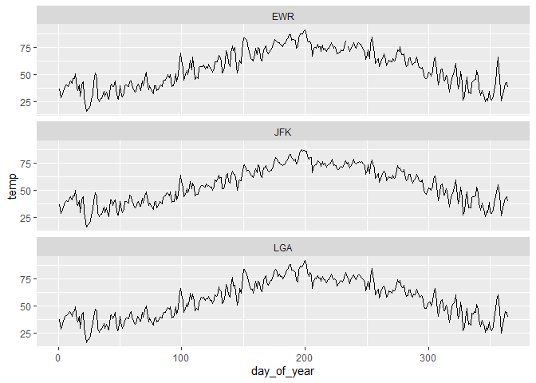

Practice Exam
================
Cameron Pak
2/27/2020

``` r
library(tidyverse)
```

    ## -- Attaching packages -------------------------------------- tidyverse 1.3.0 --

    ## v ggplot2 3.2.1     v purrr   0.3.3
    ## v tibble  2.1.3     v dplyr   0.8.4
    ## v tidyr   1.0.2     v stringr 1.4.0
    ## v readr   1.3.1     v forcats 0.4.0

    ## -- Conflicts ----------------------------------------- tidyverse_conflicts() --
    ## x dplyr::filter() masks stats::filter()
    ## x dplyr::lag()    masks stats::lag()

``` r
library(lubridate)
```

    ## 
    ## Attaching package: 'lubridate'

    ## The following object is masked from 'package:base':
    ## 
    ##     date

``` r
library(nycflights13)
library(reshape2)
```

    ## 
    ## Attaching package: 'reshape2'

    ## The following object is masked from 'package:tidyr':
    ## 
    ##     smiths

``` r
myweather <- weather %>% mutate(day_of_year = yday(time_hour))
myweather <-
  myweather %>% mutate(Date = paste(month, day, "2013", sep = "/"))
myweather$Date <- as.Date(myweather$Date, "%m/%d/%Y")
mytemp <-
  myweather %>% group_by(origin, Date) %>% summarise(temp = mean(temp))
ggplot(mytemp, aes(x = Date, y = temp)) + geom_bar(stat = 'identity', fill = "forest green") + facet_wrap(~ origin, ncol = 1)
```

    ## Warning: Removed 1 rows containing missing values (position_stack).

<!-- -->

``` r
df.wide <- pivot_wider(mytemp, names_from = Date,values_from = temp)
myflights <-
  flights %>% mutate(Date = paste(month, day, "2013", sep = "/"))
myflights$Date <- as.Date(myflights$Date, "%m/%d/%Y")
# myflights$Performance <- myflights$dep_delay < 60
```
